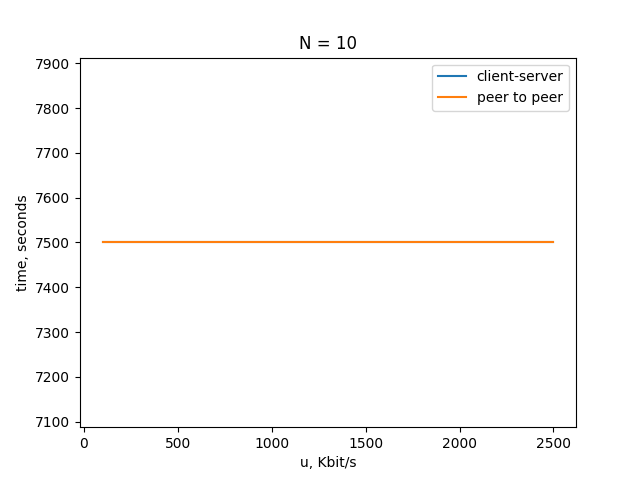
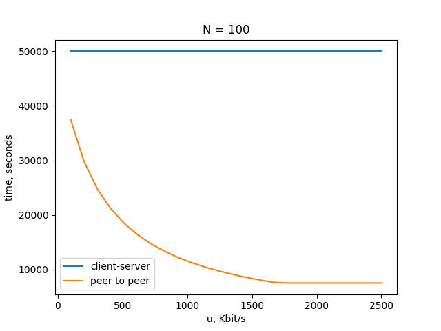
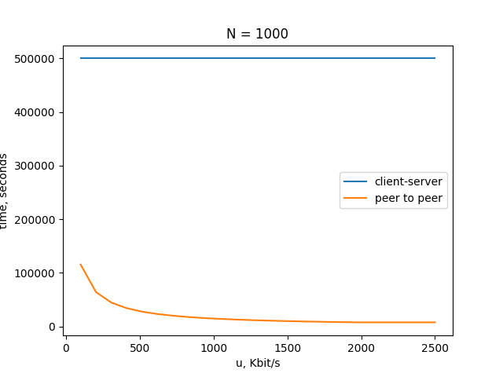

# Практика 5. Прикладной уровень

## Программирование сокетов.

### A. Почта и SMTP (7 баллов)

### 1. Почтовый клиент (2 балла)
Напишите программу для отправки электронной почты получателю, адрес
которого задается параметром. Адрес отправителя может быть постоянным. Программа
должна поддерживать два формата сообщений: **txt** и **html**. Используйте готовые
библиотеки для работы с почтой, т.е. в этом задании **не** предполагается общение с smtp
сервером через сокеты напрямую.

Приложите скриншоты полученных сообщений (для обоих форматов).

#### Демонстрация работы
todo

### 2. SMTP-клиент (3 балла)
Разработайте простой почтовый клиент, который отправляет текстовые сообщения
электронной почты произвольному получателю. Программа должна соединиться с
почтовым сервером, используя протокол SMTP, и передать ему сообщение.
Не используйте встроенные методы для отправки почты, которые есть в большинстве
современных платформ. Вместо этого реализуйте свое решение на сокетах с передачей
сообщений почтовому серверу.

Сделайте скриншоты полученных сообщений.

#### Демонстрация работы
todo

### 3. SMTP-клиент: бинарные данные (2 балла)
Модифицируйте ваш SMTP-клиент из предыдущего задания так, чтобы теперь он мог
отправлять письма с изображениями (бинарными данными).

Сделайте скриншот, подтверждающий получение почтового сообщения с картинкой.

#### Демонстрация работы
todo

---

_Многие почтовые серверы используют ssl, что может вызвать трудности при работе с ними из
ваших приложений. Можете использовать для тестов smtp сервер СПбГУ: mail.spbu.ru, 25_

### Б. Удаленный запуск команд (3 балла)
Напишите программу для запуска команд (или приложений) на удаленном хосте с помощью TCP сокетов.

Например, вы можете с клиента дать команду серверу запустить приложение Калькулятор или
Paint (на стороне сервера). Или запустить консольное приложение/утилиту с указанными
параметрами. Однако запущенное приложение **должно** выводить какую-либо информацию на
консоль или передавать свой статус после запуска, который должен быть отправлен обратно
клиенту. Продемонстрируйте работу вашей программы, приложив скриншот.

Например, удаленно запускается команда `ping yandex.ru`. Результат этой команды (запущенной на
сервере) отправляется обратно клиенту.

#### Демонстрация работы
todo

### В. Широковещательная рассылка через UDP (2 балла)
Реализуйте сервер (веб-службу) и клиента с использованием интерфейса Socket API, которая:
- работает по протоколу UDP
- каждую секунду рассылает широковещательно всем клиентам свое текущее время
- клиент службы выводит на консоль сообщаемое ему время

#### Демонстрация работы
todo

## Задачи

### Задача 1 (2 балла)
Рассмотрим короткую, $10$-метровую линию связи, по которой отправитель может передавать
данные со скоростью $150$ бит/с в обоих направлениях. Предположим, что пакеты, содержащие
данные, имеют размер $100000$ бит, а пакеты, содержащие только управляющую информацию
(например, флаг подтверждения или информацию рукопожатия) – $200$ бит. Предположим, что у
нас $10$ параллельных соединений, и каждому предоставлено $1/10$ полосы пропускания канала
связи. Также допустим, что используется протокол HTTP, и предположим, что каждый
загруженный объект имеет размер $100$ Кбит, и что исходный объект содержит $10$ ссылок на другие
объекты того же отправителя. Будем считать, что скорость распространения сигнала равна
скорости света ($300 \cdot 10^6$ м/с).
1. Вычислите общее время, необходимое для получения всех объектов при параллельных
непостоянных HTTP-соединениях
2. Вычислите общее время для постоянных HTTP-соединений. Ожидается ли существенное
преимущество по сравнению со случаем непостоянного соединения?

#### Решение
$t_{\text{расп}} = t = \dfrac{10 \, m}{3 * 10^8 \, m/s} \approx 0.00000003 \, s$  
$RTT = 2(t + \dfrac{200 \, bit}{0.1 * 150 \, bit/s}) \approx 26.67 \, s$   
$R_{\text{файл}} = R = t + \dfrac{10^5 \, bit}{0.1 * 150 \, bit/s} \approx 6666.67 \, s$   
1. $(2 * RTT + R)(10 + 1) \approx 73920 \, s$
2. $RTT + (RTT + R)(10 + 1) \approx 73653 \, s$  
Получили улучшение на несколько минут, чего и можно было ожидать, так как главным слагаемым все равно является передача самого файла, а не инициирование соединения 

### Задача 2 (3 балла)
Рассмотрим раздачу файла размером $F = 15$ Гбит $N$ пирам. Сервер имеет скорость отдачи $u_s = 30$
Мбит/с, а каждый узел имеет скорость загрузки $d_i = 2$ Мбит/с и скорость отдачи $u$. Для $N = 10$, $100$
и $1000$ и для $u = 300$ Кбит/с, $700$ Кбит/с и $2$ Мбит/с подготовьте график минимального времени
раздачи для всех сочетаний $N$ и $u$ для вариантов клиент-серверной и одноранговой раздачи.

#### Решение
Формулы и построение графиков можно посмотртеть в `plot.py`
1. 
2. 
3. 

### Задача 3 (3 балла)
Рассмотрим клиент-серверную раздачу файла размером $F$ бит $N$ пирам, при которой сервер
способен отдавать одновременно данные множеству пиров – каждому с различной скоростью,
но общая скорость отдачи при этом не превышает значения $u_s$. Схема раздачи непрерывная.
1. Предположим, что $\dfrac{u_s}{N} \le d_{min}$.
   При какой схеме общее время раздачи будет составлять $\dfrac{N F}{u_s}$?
2. Предположим, что $\dfrac{u_s}{N} \ge d_{min}$. 
   При какой схеме общее время раздачи будет составлять  $\dfrac{F}{d_{min}}$?
3. Докажите, что минимальное время раздачи описывается формулой $\max\left(\dfrac{N F}{u_s}, \dfrac{F}{d_{min}}\right)$?

#### Решение
1. Например, если отдавать каждому пиру со скоростью $\dfrac{u_s}{N}$. Тогда по условию пиры будут успевать все принимать $\implies \dfrac{F}{\dfrac{u_s}{N}} = \dfrac{N F}{u_s}$
2. Например, если отдавать каждому пиру со скоростью $d_{min}$. Тогда по условию сервер сможет отдавать данные с такой скоростью $\implies \dfrac{F}{d_{min}}$
3. Ну во-первых заметим, что это как минимум нижняя оценка. Серверу необходимо передать $NF$ бит со скоростью $u_s$, а всем пирам необходимо принять $F$ бит, в том числе и самому медленному со скоростью $d_{min}$. Но $\max\left(\dfrac{N F}{u_s}, \dfrac{F}{d_{min}}\right) = \dfrac{F}{\min\left(\dfrac{u_s}{N}, d_{min}\right)}$. Но это же то что мы делали в пунктах 1 и 2. Значит эта оценка достижима
